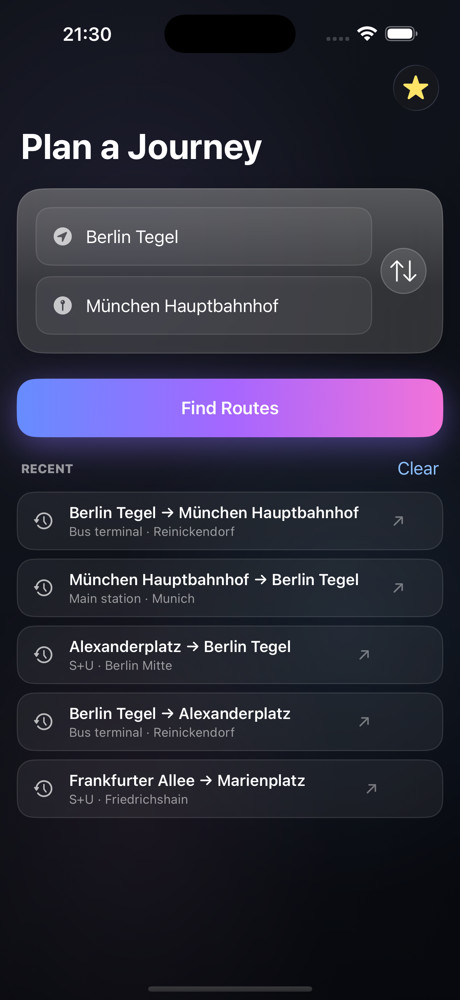
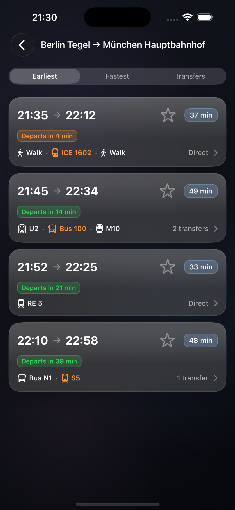
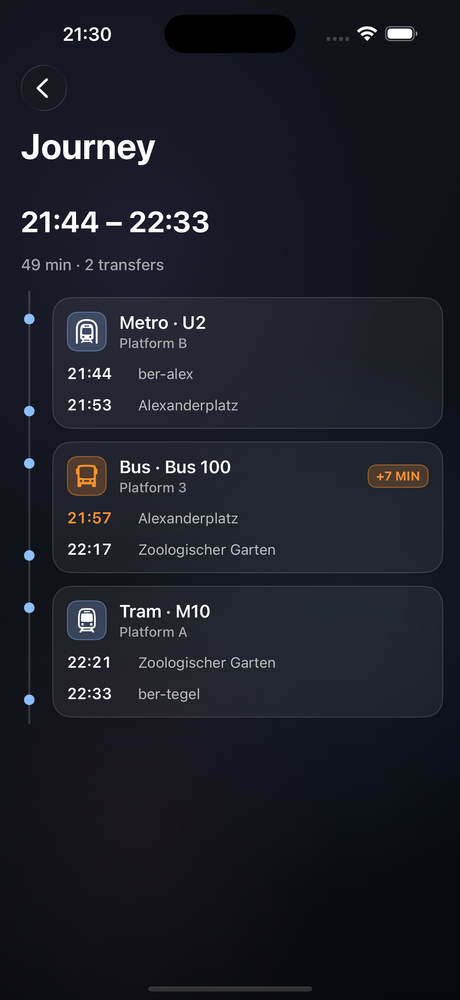
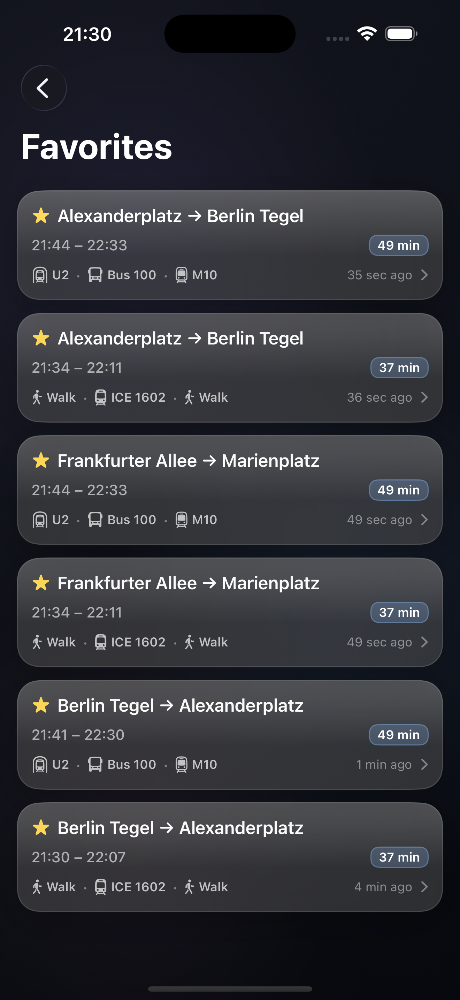
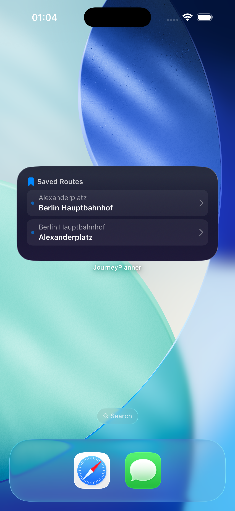
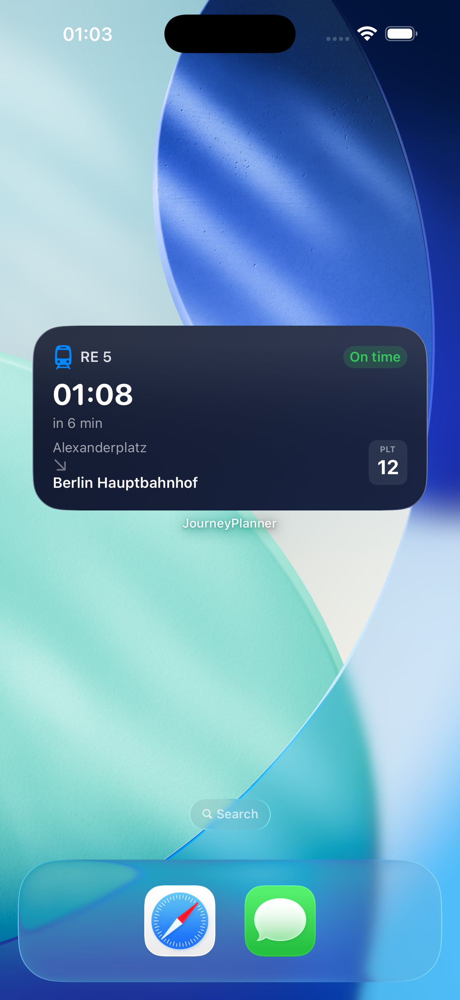
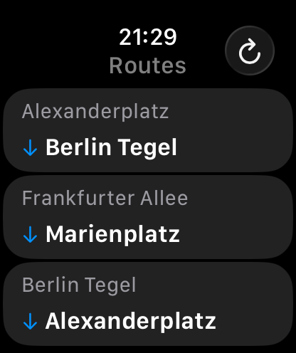
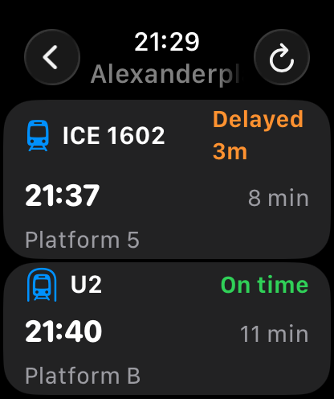

# Journey Planner

An iOS app for planning public transport journeys using mock data, with a **WidgetKit extension** and a **watchOS companion app** built on a shared services layer. Built with **UIKit + MVVM + Coordinator** on iOS, **SwiftUI** on watch and widget, and **async/await** throughout.

---

## Screenshots

| Search | Results | Details | Favorites |
| :---: | :---: | :---: | :---: |
|  |  |  |  |

| Widget Routes | Widget Departures | Watch Routes | Watch Departures |
| :---: | :---: | :---: | :---: |
|  |  |  |  |


---

## Architecture

Three platform targets share one persistence + networking spine. The iOS app is the **only writer**; the widget and the watch app are **read-only consumers** of an App Group container.

```
┌────────────────────────────┬────────────────────────────┬────────────────────────────┐
│        iOS App             │     Widget Extension       │      watchOS App           │
│   (UIKit + MVVM + Coord.)  │   (SwiftUI + WidgetKit)    │   (SwiftUI + MVVM)         │
│                            │                            │                            │
│  Coordinators              │  WidgetBundle              │  WindowGroup / NavStack    │
│      │                     │   ├─ NextDepartureWidget   │   ├─ FavoritesListView     │
│      ▼                     │   └─ QuickRouteWidget      │   └─ DeparturesView        │
│  ViewControllers / VMs     │      │                     │      │                     │
│      │                     │      ▼                     │      ▼                     │
│      ▼                     │  TimelineProvider          │  ViewModels (@Observable)  │
│  DIContainer               │      │                     │      │                     │
│      │                     │      ▼                     │      ▼                     │
│  Services + Repositories   │  WidgetSharedReader        │  WatchDataStore            │
│      │                     │      │                     │                            │
│      ▼                     │      ▼                     │                            │
│  SharedRouteSynchronizer ──┼──┐                         │                            │
│      │                     │  │                         │                            │
│      ▼                     │  ▼                         │                            │
│  AppGroupRouteStore ───────┴──┴─── App Group UserDefaults (group.app.journey.planner) ────────┘
│  (writes routes + cached departures)
│      │
│      ▼
│  SwiftData (FavoritesRepository, RecentSearchesRepository)
│      │
│      ▼
│  NetworkService (Mock / Real impl)
└─────────────────────────────────────────────────────────────────────────────────────┘
```

**Data flow**

1. User toggles a favorite in the iOS app → `SwiftDataFavoritesRepository` posts `.favoritesDidChange`.
2. `SceneDelegate` listens, calls `SharedRouteSynchronizer.syncRoutes()` → publishes lightweight `SharedRoute` DTOs into the App Group.
3. `SharedRouteSynchronizer.refreshDepartures()` runs in the background, fetches fresh journeys via the same `JourneyService`, and writes `SharedDeparture` snapshots into the App Group.
4. `WidgetCenter.reloadAllTimelines()` is invoked, prompting WidgetKit to re-render. The watch app reads the same store on `.task` / pull-to-refresh.

---

## Shared Data — App Groups

The main app and the widget target join the App Group **`group.app.journey.planner`** and exchange JSON-encoded DTOs through a shared `UserDefaults` suite. The contract lives in `AppGroup.Keys`:

`SharedRoute` and `SharedDeparture` are intentionally flat, free of UIKit/SwiftUI imports, and duplicated verbatim across targets so each can compile against only the frameworks it needs. The iOS app is the only writer; widget/watch reads are best-effort and fall back to placeholder/sample data when the cache is cold.

---

## Multi-Platform Architecture Decisions

- **One service spine, three UIs** — `NetworkService`, `JourneyService`, and `FavoritesRepository` live in the iOS target. The widget and watch never call the network directly; they read pre-rendered DTOs from the App Group. This keeps timeline budgets predictable, avoids duplicating mock backends, and makes offline behavior trivial (last cache wins).
- **DTOs over domain models** — `Journey`/`Leg`/`Location` are rich value types tuned for the iOS UI. Pushing them across processes would bloat the widget budget and couple every target to every model change. The lightweight `SharedRoute`/`SharedDeparture` types are a stable on-the-wire contract.
- **Synchronization is push, not pull** — `SharedRouteSynchronizer` publishes on app launch, on every favorite mutation, and on `sceneDidBecomeActive`. The widget then reloads timelines through `WidgetCenter`. The watch picks up changes naturally on its next read.
- **Each target owns its own architecture** — UIKit + Coordinator scales nicely on iOS; SwiftUI + `@Observable` is the right fit for the watch's small surface and tight render loop. Shared *concepts* (MVVM, protocol-oriented services, DI) carry across, but we don't try to share view code that doesn't want to be shared.
- **Deep linking via `widgetURL` / `Link`** — the widget builds URLs of the form `journeyplanner://route?originId=…&originName=…&destId=…&destName=…`. `SceneDelegate` forwards them to `AppCoordinator.handle(deepLink:)` which pops to root and pushes `ResultsCoordinator`, replaying the journey lookup in the same MVVM flow as a manual search.

---

## Features

### iOS app
- **Search** — From / To fields with autocomplete, swap button, recent searches.
- **Results** — Route options with departure, arrival, duration, transfers.
- **Details** — Per-leg breakdown with transport type, line, platform, delay highlighting.
- **Favorites** — One-tap save from results; dedicated tab to browse and re-run saved trips.
- **State handling** — Loading, empty, and error states across all lists.

### WidgetKit extension
- **Next Departure Widget** (small / medium) — first transit leg of the next saved-route journey, with line, platform badge, on-time/delayed pill, and minutes-until-departure.
- **Quick Routes Widget** (small / medium) — up to 2 saved routes, each tap deep-links to the iOS results screen.
- **Timeline policy** — refresh every 5 min for departures, every 15 min for the route grid; `WidgetCenter.reloadAllTimelines()` invalidates the timeline immediately on every iOS-side change.
- **Placeholder + snapshot states** — sample data for the widget gallery, graceful empty states when no routes are saved.

### watchOS app
- **Favorites screen** — saved routes, pull-to-refresh, toolbar refresh button.
- **Departures screen** — upcoming departures for the tapped route, time / platform / status.
- **Loading + empty + error states** — every screen handles `idle`, `loading`, `loaded`, `empty`, `failed`.
- **Sample fallback** — when the App Group cache is cold, the watch shows a small set of fixtures so the UI is never blank.

---

## Tech Stack

- **Language**: Swift 5.9+
- **iOS UI**: UIKit, programmatic Auto Layout (no Storyboards)
- **Widget UI**: SwiftUI + WidgetKit
- **Watch UI**: SwiftUI, `NavigationStack`, `@Observable` view models
- **Architecture**: MVVM + Coordinator (iOS), MVVM (watch), protocol-oriented services, DI containers
- **Concurrency**: `async/await`, `Task`, `MainActor`, strict `nonisolated` data types
- **Persistence**: `SwiftData` (`@Model` entities for favorites and recent searches)
- **Cross-target storage**: App Group `UserDefaults` suite (`group.app.rork.i2jxacaagr1pjqjh9ebe6`)
- **Deep linking**: custom URL scheme `journeyplanner://`
- **Networking**: `URLSession` behind a `NetworkService` protocol (mock + real)
- **Min iOS**: 18.0 · **Min watchOS**: 11.0

---

## Getting Started

```bash
open ios/JourneyPlanner.xcodeproj
```

Pick the `JourneyPlanner` scheme on an iOS 18+ simulator, or the `JourneyPlannerWatch` scheme on a watchOS 11+ simulator. The widget appears in the iOS Simulator's widget gallery once the iOS app has run at least once (so the App Group has data).

---

## Project Highlights

- Three targets share **one** networking/service spine — no duplicated business logic.
- Coordinators own iOS navigation; SwiftUI `NavigationStack` owns watch navigation.
- App Group + DTO-based contract isolates cross-process changes.
- Every service is behind a protocol — trivial to swap a real backend or test double in.
- No third-party dependencies.
